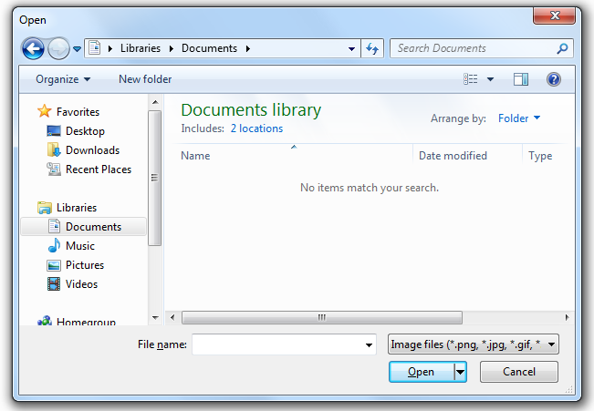

# node-native-dialog

Display native message boxes / common dialogs.

By native it means OS level in Node.js, not in the browser.

## Requirements

Needs desktop environment, command line only environment is not supported.

Supported platforms:

- Windows (Windows XP or above, with the compiled binary included)

- Linux (requires `zenity`)

## Get started

Import it to your script.

```js
const dialog = require('node-native-dialog');
```

Display a simple message box

```js
dialog.info('Hello world!', 'Message');
```

## API and examples

- **info(text, title): Promise&lt;void&gt;**

- **error(text, title): Promise&lt;void&gt;**

- **warning(text, title): Promise&lt;void&gt;**

  `text` - string, required, the message

  `title` - string, required, title of the dialog box

  Display a simple information / error / warning message box. The promise will resolve after the message box is closed.

  

  ```js
  info('This is an information message', 'Information')
  ```

- **question(text, title): Promise&lt;boolean&gt;**

  `text` - string, required, the message

  `title` - string, required, title of the dialog box

  Display a OK/Cancel message box. Return true if OK is clicked. Return false if Cancel is clicked or the window is closed.

  

  ```js
  question('Are you sure?', 'Question')
  ```

- **entry(text, title, default): Promise&lt;string | null&gt;**

- **password(text, title, default): Promise&lt;string | null&gt;**

  `text` - string, required, the message

  `title` - string, required, title of the dialog box

  `default` - string, optional, the default value of the text box

  Display a message box that user can enter text in it. Return the text if OK is clicked. Return null if Cancel is clicked or the window is closed.

  If `password` is used, the text box is a password box, characters are '*'.

  

  ```js
  entry('What\'s your favorite animal?', 'Input box', 'cat')
  ```

- **color(options): Promise&lt;number | null&gt;**

  *options:*

  `full` - boolean, optional, expand the full color picker by default

  `color` - number, optional, the default selected color

  `templates` - optional, an array of colors to display in the "Custom colors" field, 16 items at most, Windows only

  Display the color picker dialog. Return the color if OK is clicked. Return null if Cancel is clicked or the window is closed.

  Colors are in `0xRRGGBB` format.

  

  ```js
  color({ full: true, color: 0xff8000 })
  ```

- **open(options): Promise&lt;string | string[] | null&gt;**

- **save(options): Promise&lt;string | null&gt;**

  *options:*

  `multiple` - boolean, optional, Open Dialog only, allow selecting multiple files

  `name` - string, optional, the default file name

  `title` - string, optional, set the title of the file dialog

  `initial` - string, optional, specify the initial directory when the dialog appears

  `filters` - optional, an array of file name filters (`[description, pattern 1, pattern 2, ...]`)

  Display the open / save file dialog. Return the absolute path if Open / Save is clicked. Return null if Cancel is clicked or the window is closed.

  If `multiple` is set to true for the open file dialog, the return value is an array of file paths.

  

  ```js
  open({
  	filters: [
  		['Image files (*.png, *.jpg, *.gif, *.bmp)', '*.png', '*.jpg', '*.gif', '*bmp'],
  		['All files (*.*)', '*.*'],
  	]
  })
  ```

- **directory(options): Promise&lt;string | null&gt;**

  *options:*

  `title` - string, optional, text to be displayed on the banner of the dialog

  `initial` - string, optional, specify the initial directory when the dialog appears

  Display a file dialog that can only select folders. Return the absolute path if OK is clicked. Return null if Cancel is clicked or the window is closed.

  

  ```js
  directory({ title: 'Choose a folder to store your configuration' })
  ```

- **setEncoding(encoding)**

  `encoding` - string, optional, the encoding to use, or undefined to disable character transcoding

  Specify the encoding of the console. Unicode characters may display incorrectly on Windows in some locales due to console encoding mismatch.

  For example in simplified Chinese locale (GB2312 encoding), you need to use `setEncoding('gbk')` if unicode characters are incorrect in return values.

*Example scripts are available in /examples, you can try them out by yourself*

## Compile the Windows version from source

The source files can be found in `/vs-project`. You can use Visual Studio to edit and build. Make sure you selected the Release configuration.

You can also use MinGW to build. To do so, you need to have [mingw-w64](https://sourceforge.net/projects/mingw-w64/files/mingw-w64/) in your PATH, then run `build-mingw.bat`. The built binary has better native compatibility across multiple Windows versions in this way.

## Known issues

- This is still experimental and there might be issues.

- The promise rejects if the dialog process fails to start or exits unexpectedly. Add error handling if you're using it in a fatal process.

## Contributing

Contributing is open. Open an issue, or comment on an existing one before starting a PR, if you want the best chance of it being accepted. (I don't want to see wasted effort)

## License

MIT
