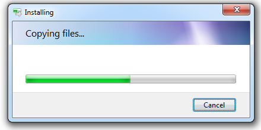

# node-native-dialog

Display native message boxes / common dialogs.

By native it means OS level in Node.js, not in the browser.

## Requirements

Needs desktop environment

Supported platforms:

- Windows (If the included binary is not compatible with your Windows, consider [compiling it from source](#compile-from-source))

- Linux (requires `zenity`)

## Get started

Import it to your script.

```js
const dialog = require('node-native-dialog');
```

Display a simple message box.

```js
dialog.info('Hello world!', 'Message');
```

## API and examples

- **info(text, title): Promise&lt;void&gt;**
- **error(text, title): Promise&lt;void&gt;**
- **warning(text, title): Promise&lt;void&gt;**

  | Argument | Type   | Description       |
  |----------|--------|-------------------|
  | `text`   | string | The message       |
  | `title`  | string | Text in title bar |

  Displays a simple information / error / warning message box.

  

  ```js
  info('This is an information message', 'Information')
  ```

- **question(text, title): Promise&lt;boolean&gt;**

  | Argument | Type   | Description       |
  |----------|--------|-------------------|
  | `text`   | string | The message       |
  | `title`  | string | Text in title bar |

  Displays a OK/Cancel message box. Returns true if OK is clicked, or false if Cancel is clicked.

  

  ```js
  question('Are you sure?', 'Question')
  ```

- **entry(text, title, default): Promise&lt;string | null&gt;**
- **password(text, title, default): Promise&lt;string | null&gt;**

  | Argument  | Type    | Description                    |
  |-----------|---------|--------------------------------|
  | `text`    | string  | The message                    |
  | `title`   | string  | Text in title bar              |
  | `default` | string? | Default value of the input box |

  Displays a message box with an input box. Returns the text if OK is clicked, or null if Cancel is clicked.

  If `password` is used, the text box is a password box, characters are '*'.

  

  ```js
  entry('What\'s your favorite animal?', 'Input box', 'cat')
  ```

- **color(options): Promise&lt;number | null&gt;**

  *options:*

  | Property    | Type      | Description                           |
  |-------------|-----------|---------------------------------------|
  | `full`      | boolean?  | Show the full color picker by default |
  | `color`     | number?   | Default selected color                |
  | `templates` | number[]? | Array of colors to display in the "Custom colors" field, 16 items at most, Windows only |

  Displays the color picker. Returns the color if OK is clicked, or null if Cancel is clicked.

  Color format is `0xRRGGBB`.

  

  ```js
  color({ full: true, color: 0xff8000 })
  ```

- **open(options): Promise&lt;string | string[] | null&gt;**
- **save(options): Promise&lt;string | null&gt;**

  *options:*

  | Property    | Type        | Description                    |
  |-------------|-------------|--------------------------------|
  | `multiple`  | boolean?    | Allow selecting multiple files |
  | `name`      | string?     | Default file name              |
  | `title`     | string?     | Title of the file dialog       |
  | `initial`   | string?     | Initial directory              |
  | `filters`   | string[][]? | Array of file filters `[description, pattern 1, pattern 2, ...]` |

  Displays the open / save file dialog. Returns the absolute path if Open / Save is clicked, or null if Cancel is clicked.

  If `multiple` is set to true for opening file, the return value is an array.

  

  ```js
  open({
  	filters: [
  		['Image files (*.png, *.jpg, *.gif, *.bmp)', '*.png', '*.jpg', '*.gif', '*.bmp'],
  		['All files (*.*)', '*.*'],
  	]
  })
  ```

- **directory(options): Promise&lt;string | null&gt;**

  *options:*

  | Property  | Type    | Description                      |
  |-----------|---------|----------------------------------|
  | `title`   | string? | Text on the banner of the dialog |
  | `initial` | string? | Initial directory                |

  Displays the select folder dialog. Returns the absolute path if OK is clicked, or null if Cancel is clicked.

  

  ```js
  directory({ title: 'Choose a folder to store your configuration' })
  ```

- **progress(options): instance**

  *options:*

  | Property        | Type     | Description        |
  |-----------------|----------|--------------------|
  | `text`          | string   | The message        |
  | `title`         | string   | Text in title bar  |
  | `value`         | number?  | Initial percentage |
  | `indeterminate` | boolean? | Sets the progress bar to marquee mode. Use this when you wish to indicate that progress is being made, but the exact value is unknown |
  | `noCancel`      | boolean? | Do not display a cancel button. The operation cannot be canceled |

  *instance:*

  | Property   | Type     | Description        |
  |------------|----------|--------------------|
  | `promise`  | Promise&lt;boolean&gt;   | The original promise. Returns true if the progress is finished, or false if Cancel is clicked |

  | Method            | Description        |
  |-------------------|--------------------|
  | `setText(text)`   | Change the message |
  | `setValue(value)` | Change the percentage. Setting progress to 100 will finish the progress and close the dialog  |

  Displays a progress bar dialog.

  

   ```js
  progress({ title: 'Installing', text: 'Copying files...', value: 50 })
  ```

- **setEncoding(encoding)**

  - `encoding` - string, optional, the encoding to use, or undefined to disable character transcoding

  Specify the encoding of the console. Unicode characters may display incorrectly on Windows using some locales.

  For example the simplified Chinese locale (GB2312 encoding), you need to use `setEncoding('gbk')` if unicode characters are incorrect in return values.

More examples can be found in `/examples`

## Compile from source

The source codes of the required Windows executable can be found in `/vs-project`. It's a Visual Studio project.

## Known issues

- This is still experimental and there might be issues.

- The promise rejects if the dialog process fails to start or exits unexpectedly. Add error handling if you're using it in a critical process.

## License

MIT
